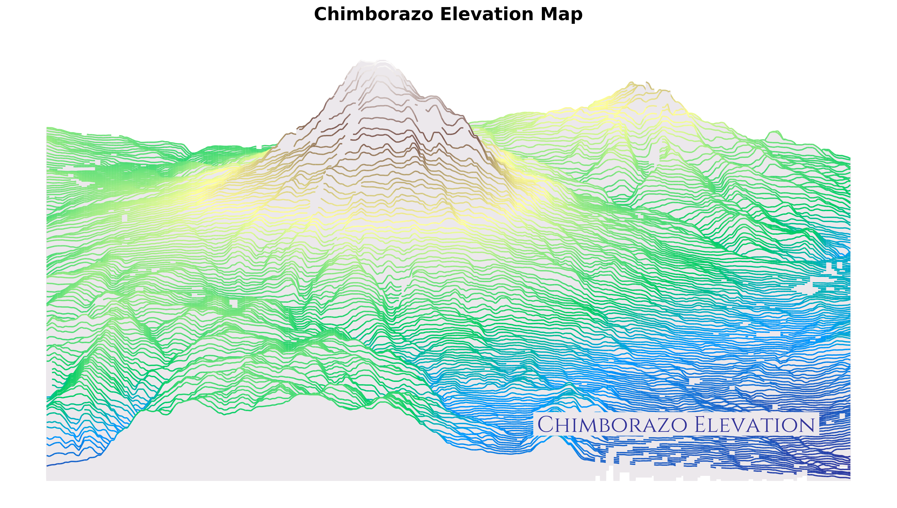
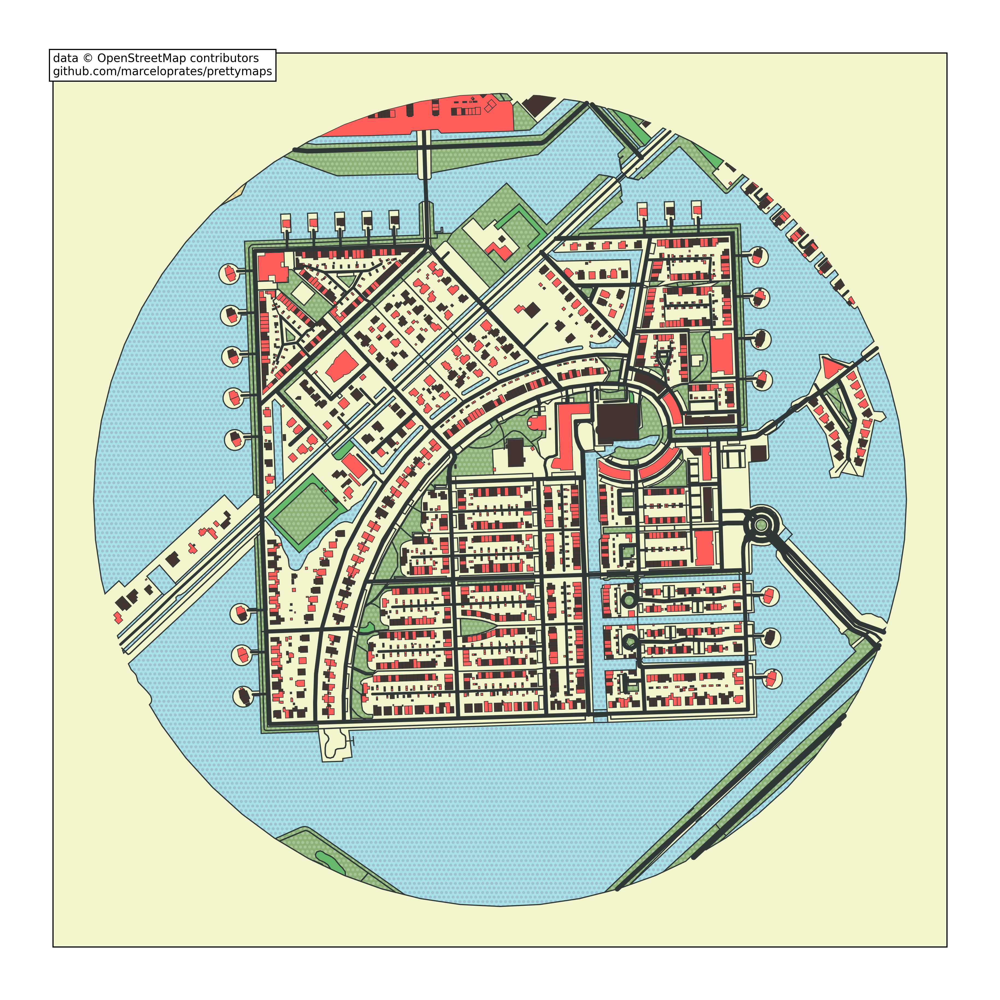
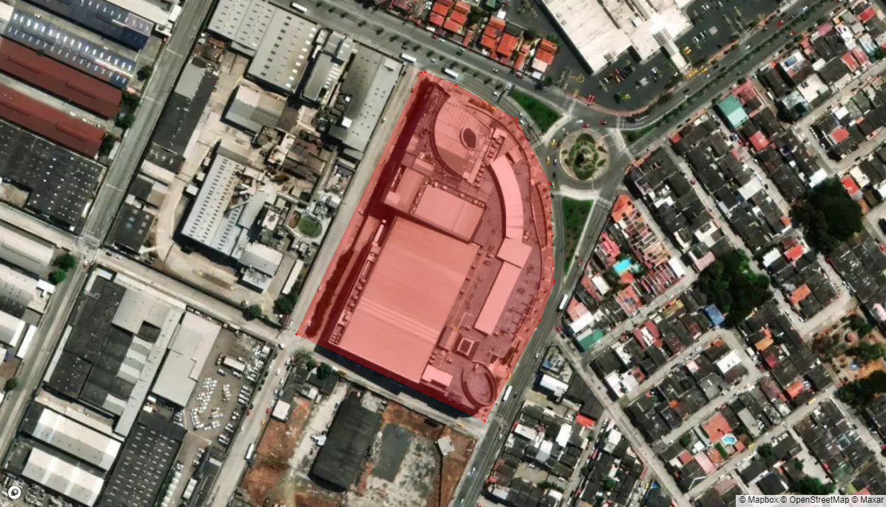
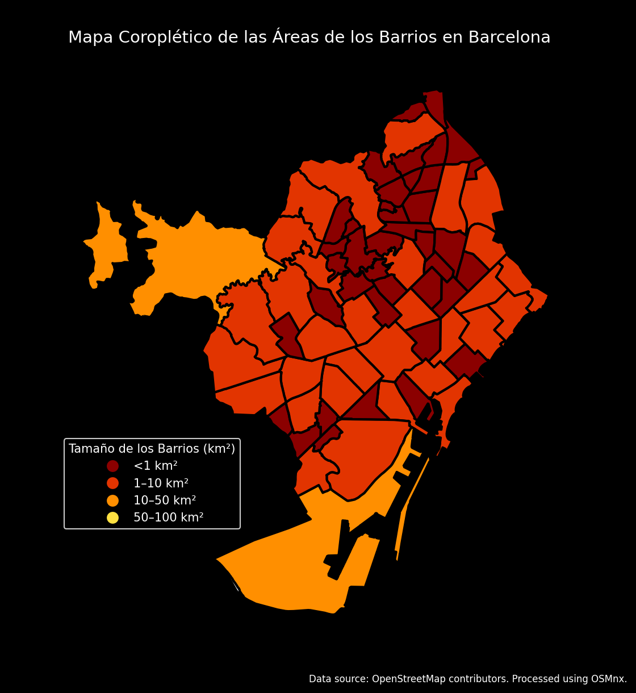

# Geospatial Data Analysis









## Overview
This repository contains a collection of Python scripts designed for geographical data analysis and visualization. These tools provide functionalities for processing KML/KMZ files, calculating polygon areas, generating HTML maps, and more.

## Features

1. **File Handling**
    - Extract ZIP/KMZ files to access internal KML files.
    - Convert KMZ files to KML format.

2. **Geospatial Data Processing**
    - Read KML files into GeoDataFrames for easy manipulation.
    - Validate and classify coordinates (Decimal Degrees or UTM).
    - Calculate polygon areas in hectares.

3. **Visualization**
    - Generate interactive HTML maps with Folium, including basemap overlays and polygon visualizations.

4. **GeoJSON Handling**
    - Add custom attributes to GeoJSON files and save updated outputs.

5. **Utilities**
    - Calculate string similarity for comparing names or identifiers.

## Installation

Clone the repository and install the required dependencies:

```bash
git clone https://github.com/hitthecodelabs/Geospatial-Data-Analysis.git
cd Geospatial-Data-Analysis
pip install -r requirements.txt
```

## Usage

### 1. Extract ZIP/KMZ Files
```python
from geo_scripts import unzip_file

unzip_file('path/to/your.zip', 'output/directory')
```

or

```python
from geo_scripts import unzip_file

unzip_file('path/to/your.kmz', 'output/directory')
```

### 2. Convert KMZ to KML
```python
from geo_scripts import convert_kmz_to_kml

kml_path = convert_kmz_to_kml('path/to/your.kmz')
```

### 3. Read KML into GeoDataFrame
```python
from geo_scripts import read_kml

gdf, features = read_kml('path/to/your.kml')
```

### 4. Generate HTML Maps
```python
from geo_scripts import generate_html_map

generate_html_map(gdf, 'output/maps', start_index=0, end_index=10)
```

### 5. Calculate Polygon Area
```python
from geo_scripts import calculate_polygon_area

areas_gdf = calculate_polygon_area('path/to/your.kml')
```

### 6. Add Attribute to GeoJSON
```python
from geo_scripts import add_attribute_to_geojson

add_attribute_to_geojson('input.geojson', 'new_key', 'new_value', 'output.geojson')
```

## Requirements

- Python 3.8+
- Required libraries: `os`, `shutil`, `fiona`, `pyproj`, `zipfile`, `numpy`, `geopandas`, `folium`, `BeautifulSoup4`

Install the dependencies using:

```bash
pip install -r requirements.txt
```

## Contributing

Feel free to fork this repository and submit pull requests. Please ensure code follows PEP 8 standards and includes docstrings for all functions.

## License

This project is licensed under the MIT License. See the LICENSE file for details.

## Acknowledgments

This project uses open-source libraries and tools, including:

- [Fiona](https://github.com/Toblerity/Fiona)
- [GeoPandas](https://geopandas.org/)
- [Folium](https://python-visualization.github.io/folium/)
- [BeautifulSoup](https://www.crummy.com/software/BeautifulSoup/)

## Contact

For questions or feedback, please reach out to the repository owner.
